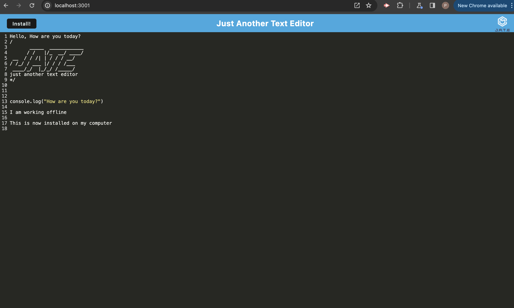

# JATE: A Progressive Web Application (PWA): Text Editor

## Description

   

JATE (Just Another Text Editor) is a text editor that runs in the browser. The app is a single-page application that meets the PWA criteria. Additionally, it features a number of data persistence techniques that serve as redundancy in case one of the options is not supported by the browser. The application will also function offline.

After installing the application with a click of a button, use the DevTools to inspecy how the application runs behind the scenes.  

Heroku Website: 

Video: https://drive.google.com/file/d/1wx9AUqLyWz7dVdTX4jG0fteDX6Bu8oTs/view

----------------------

  ## Table of Contents 
  
  - [Description](#description)
  - [Installation](#installation)
  - [Usage](#usage)
  - [Credits](#credits)
  - [License](#license)
  - [Questions](#questions)

---------------------- 

  ## Installation
 1. Go to the Heroku site (linked in the [Description](#description))
 2. Click the install button
 3. To view with DevTools, right click and go to Application

----------------------

  ## Usage

  This application is an example of text editor that runs in the browser.  It can be used online or off, while data is cached.  You can use the text editor as a note application.
  
----------------------

  ## Credits
  
 I relied on class material (Mini Project for Module 19) and BCS to guide me in the construction of this PWA.
  
----------------------

  ## License
  
  This project is licensed under the terms of the MIT license.  Click the badge at the top of the README to get more information about the license.
  
----------------------

  ## Questions

  Name: Pamela Agrast 
  Repository: https://github.com/agrastp/PWA_Text_Editor 
  E-mail: agrastp@yahoo.com
  
  
